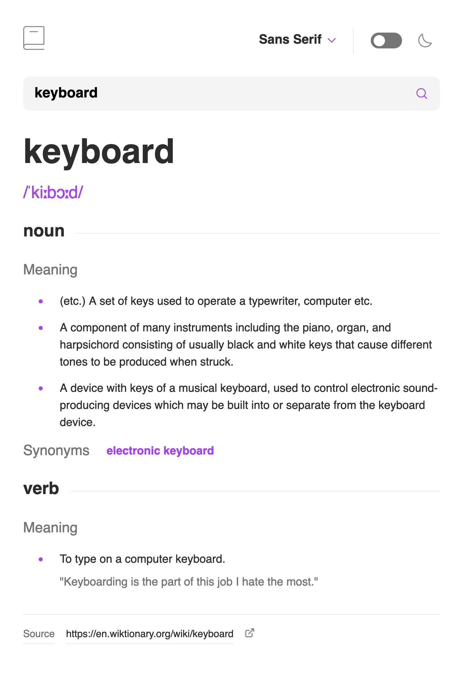

# Dictionary Web App

This is a solution to the [Dictionary web app challenge on Frontend Mentor](https://www.frontendmentor.io/challenges/dictionary-web-app-h5wwnyuKFL). Frontend Mentor challenges help you improve your coding skills by building realistic projects. 

## Table of contents

- [Overview](#overview)
- [Screenshots](#screenshots)
- [Links](#links)
- [Built with](#built-with)

## Overview

Users are able to:

- Search for words using the input field
- See the Free Dictionary API's response for the searched word
- Switch between serif, sans serif, and monospace fonts
- Switch between light and dark themes
- View the optimal layout for the interface depending on their device's screen size
- See hover and focus states for all interactive elements on the page

## Screenshots
### Desktop

### Tablet

### Mobile

## Links

- Solution URL: [github.com/cpappas18/dictionary-app.git](https://github.com/cpappas18/dictionary-app.git)
- Live Site URL: [cpappas18/github.io/dictionary-app](https://cpappas18/github.io/dictionary-app)

##  Built with

- React
- SASS
- Flexbox
